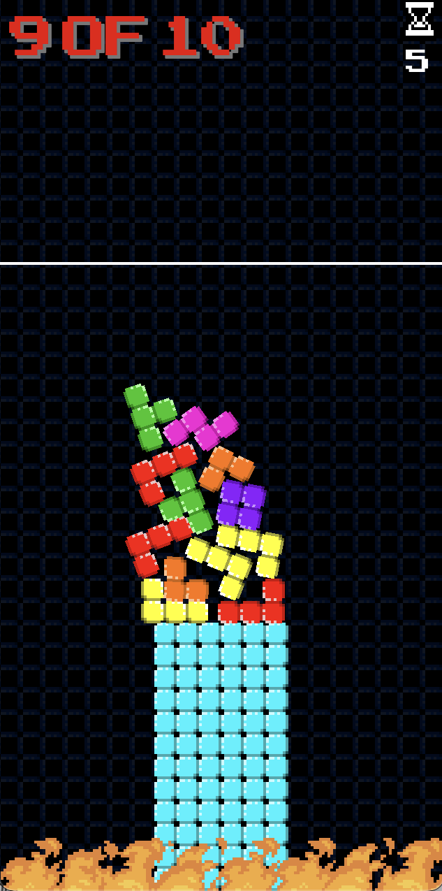

# Tower Trials

## Description

Tower Trials is a tiny game built for the Netlight GameJam 2025, with the theme "Construction/Destruction".
It was also judged to be the winning submission!

The game concept is a "reverse Tetris":
Tetris blocks fall from the top, and you need to stack them up to a certain height!
Blocks falling off the tower fall into the flames and bring you closer to a game over, so try to lose a little as possible!
To make things harder, "incoveninences" spawn at regular intervals.
Play to find out which one you hate most!

## Resources

I tried my best to find resources that are free to use for non-commercial purposes:

- Tetrominos: https://zrodfects.itch.io/8x8-tetris-and-dr-mario-style-puzzle-tile-set1-asset-pack
- Music: https://tiptoptomcat.itch.io/8-bit-gameboy-songs-vol-2-gb-studio
- SFX: https://hunteraudio.itch.io/8bit-sfx-and-music-pack
- Arcade Font: https://www.1001fonts.com/arcadeclassic-font.html
- Fire Effect: https://bdragon1727.itch.io/free-effect-bullet-impact-explosion-32x32
- Medal: https://stockcake.com/i/golden-victory-emblem_3154626_1643529
- Cursors / Crosshair: https://kenney.nl/assets/cursor-pixel-pack
- Key Prompts: https://kenney.nl/assets/input-prompts-pixel-16
